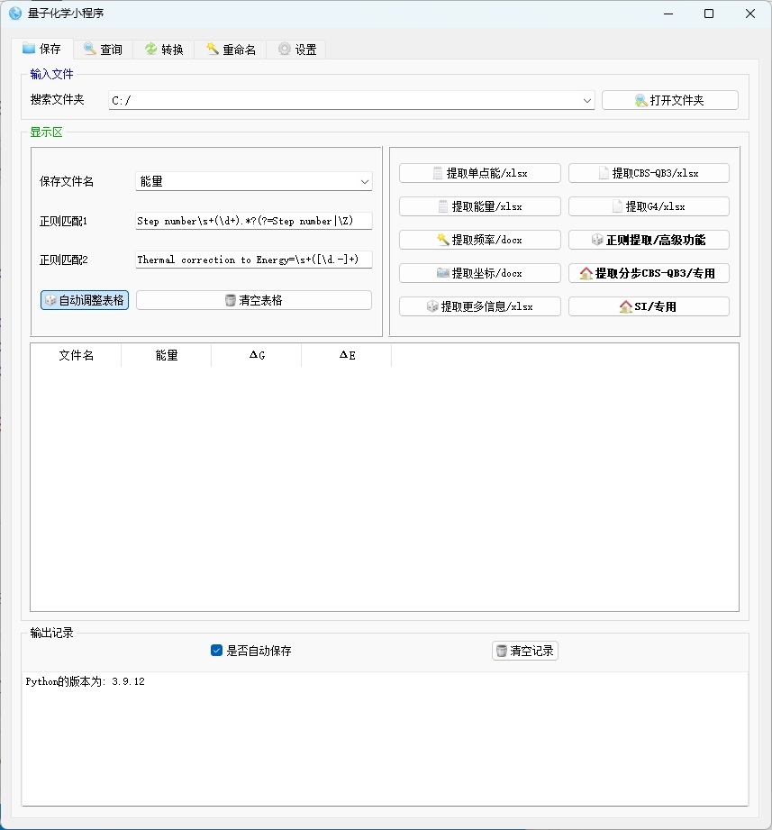
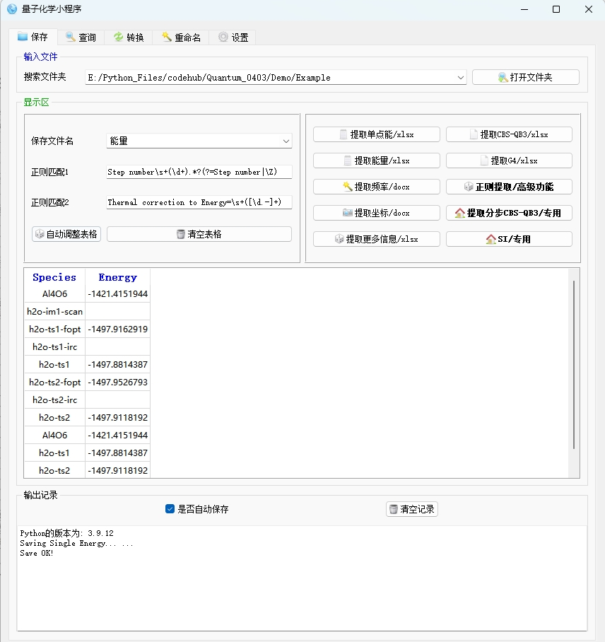
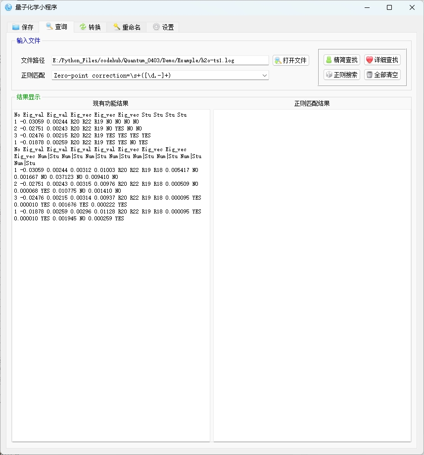
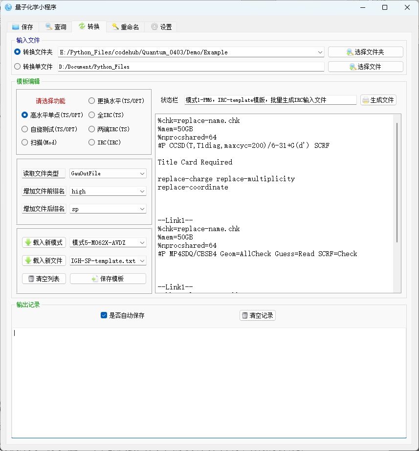
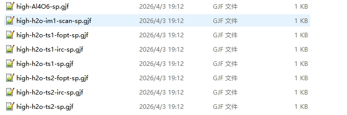
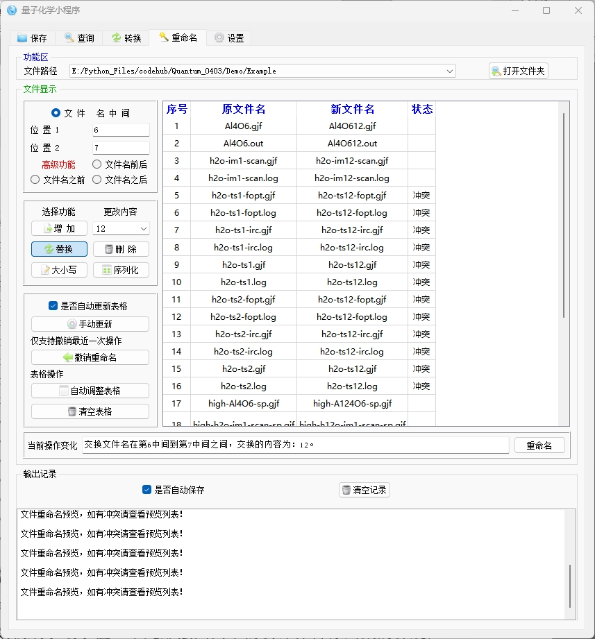
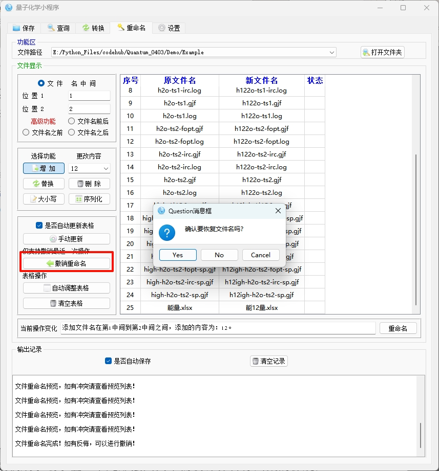

# 软件使用示例

以下四个示例覆盖了软件的四大核心功能。您可以根据实际需求，参照每个示例中的步骤进行操作

---

## 示例 1：批量提取文件夹内所有 log/out 文件的单点能

**目的**  

从包含多个 Gaussian 输出文件（`.log` / `.out`）的文件夹中，批量提取每个文件最后一步的 HF 单点能量，并保存到 Excel 表格中。

**操作步骤**

1. 打开软件，确保当前位于 **“保存”** 页签（第一个页签）。

   

2. 点击 **“打开文件夹”** 按钮，选择存放 log/out 文件的文件夹（例如 `D:\MyProjects\energies`）。  选中的路径会出现在“搜索文件夹”下拉框中，并自动保存到历史记录。

3. 在 **“保存文件名”** 下拉框中输入输出表格的名称，例如 `单点能汇总`（不需要写扩展名，程序会自动添加 `.xlsx`）。

4. 点击 **“提取单点能/xlsx”** 按钮。 
   

程序会依次读取文件夹内所有 `.log` / `.out` 文件，从每个文件的**末尾**向前搜索 `|HF=...|` 或 `\HF=...\` 字段（已处理跨行问题），提取最后一步的 HF 能量。

5. 处理完成后：
   - 主界面的表格区域会显示“物种名”和“能量”两列数据预览。
   - 在文件夹内会生成 `单点能汇总.xlsx` 文件。
   - 如果“设置”中启用了“自动打开文件”，Excel 文件会自动打开。

   
   
6. 如需提取热力学修正能量（ZPE、焓、自由能等），可点击 **“提取能量/xlsx”** 按钮，输出表格包含 10 列详细数据。

**技术说明**  
- 能量提取采用 **从后往前读取 + 两行拼接** 的策略，避免 HF= 值跨行带来的提取失败问题，即使文件很大也能快速定位到最后一步的能量。
- 支持 `|HF=...|`（`.out` 格式）和 `\HF=...\`（`.log` 格式）两种写法。

---

## 示例 2：查找过渡态输出文件中的本征值、本征向量与收敛状态

**目的**  

打开一个过渡态（TS）优化或 IRC 计算的输出文件，查看每一步的四个收敛判据（YES/NO）、特征值（Eigenvalues）和特征向量（Eigenvectors），快速定位优化失败的原因，或使用正则表达式搜索特定信息。

**操作步骤**

1. 切换到 **“查询”** 页签（第二个页签）。

2. 点击 **“打开文件”** 按钮，选择一个过渡态计算的 `.log` 或 `.out` 文件（例如 `ts_opt.log`）。

3. **查看精简信息**  
   
   点击 **“精简查找”** 按钮。  

   左侧“现有功能结果”文本框中会显示类似下面的内容：
   
   ```
   No Eig_val Eig_val Eig_vec Eig_vec Eig_vec Stu Stu Stu Stu
   1 -0.0253 -0.0025 0.0001 0.0002 -0.0003 YES YES YES YES
   2 -0.0248 -0.0023 0.0001 0.0002 -0.0002 YES YES YES YES
...
   ```
   
每一行对应一个优化步，依次为：步号、前两个特征值、前三个特征向量、四个收敛判据（YES/NO）。  
   若发现某一步的收敛判据出现 **NO**，可快速定位到不收敛的步。

4. **查看详细信息**  

   点击 **“详细查找”** 按钮，输出内容更丰富，包含四个特征值、四个特征向量以及八个收敛判据的数值（Force、Displacement 等）。

   

5. **正则表达式搜索**  

   在“正则匹配”下拉框中输入或选择正则表达式，例如 `Zero-point correction=\s+([\d.-]+)` 用于提取零点能。 

   点击 **“正则搜索”**，匹配到的内容会显示在右侧“正则匹配结果”文本框中。

6. 使用 **“全部清空”** 按钮可一键清空两个结果区域。

**技术说明**  
- 本征值和本征向量是从文件中 `Eigenvalues ---` 和 `Eigenvectors` 部分解析得到。
- 收敛判据（Maximum Force, RMS Force, Maximum Displacement, RMS Displacement）通过正则匹配 `YES`/`NO` 获得。
- 所有数据按优化步组织，便于追踪计算过程。

---

## 示例 3：生成高水平单点能计算输入文件（转换模块）

**目的**  

基于一个已完成的过渡态优化输出文件（`.log`），生成一个高水平的单点能计算输入文件（`.gjf`），例如将 M062X/6‑31G(d,p) 提升到 CCSD(T)/aug‑cc‑pVDZ 水平。同时演示如何为 IRC 任务批量生成输入文件。

**操作步骤（高水平单点）**

1. 切换到 **“转换”** 页签（第三个页签）。

2. **选择源文件**  
   - 勾选 **“转换单文件”**。
   - 点击 **“选择文件”**，选取一个 TS 优化完成且收敛的 `.log` 文件（例如 `ts_b3lyp.log`）。

3. **设置转换参数**
   - **读取文件类型**：选择 `GauOutFile`（从输出文件读取坐标、电荷、自旋多重度）。
   - **请选择功能**：勾选 **“高水平单点(TS/OPT)”**。
   - **增加文件前缀名**（可选）：输入 `high-`。
   - **增加文件后缀名**（可选）：输入 `sp`。
   - **计算模式**：选择已配置好的高水平模板，例如 `模式5-M062X-AVDZ`（若需要更高水平如 CCSD(T)，可先通过“载入新模式”导入自定义模板文件夹）。
   - **模板文件**：选择 `HIGH-SP-template.txt`（软件自带的单点能模板）。

4. **（可选）编辑模板**  
   
右侧文本编辑区显示 `HIGH-SP-template.txt` 的内容，可手动修改其中的基组、方法或其它关键词。修改后点击 **“保存模板”** 将更改写入文件。
   
5. **执行转换**  

6. 点击 **“生成文件”**。  

7. 状态栏会显示当前配置，例如：  

   `模式5-M062X-AVDZ HIGH-SP-template.txt 批量生成高水平单点输入文件`

   

8. 转换成功后，在源文件同目录下会生成一个新文件，命名如 `high-ts_b3lyp-sp.gjf`。若启用了“自动打开文件”，文件夹会自动弹出。

   

**操作步骤（批量生成 IRC 输入文件）**

1. 勾选 **“转换文件夹”**，并选择一个包含多个 TS 输出文件的文件夹。
2. **请选择功能**：勾选 **“全IRC(TS)”**。
3. 设置前缀/后缀，例如前缀 `irc-`，后缀 `forward`。
4. 选择对应的 IRC 模板（如 `IRC-template.txt`）。
5. 点击 **“生成文件”**，程序会为文件夹内每个 TS 输出文件生成一个 IRC 输入文件。

**技术说明**  
- 模板中的 `replace-name`、`replace-coordinate`、`replace-charge`、`replace-multiplicity` 会被自动替换为实际值。
- 对于“两端IRC”功能，会同时生成 `-f.gjf`（前向）和 `-r.gjf`（后向）两个文件。
- 对于“自旋测试”功能，会根据初始自旋多重度自动生成一系列不同自旋的文件（如 spin=1,3,5,…）。

---

## 示例 4：统一修改计算结果文件名（重命名模块）

**目的**  

完成一批计算后，需要将输出文件按照统一规则重新命名，例如在原文件名前添加“final_”，删除某些冗余字符，或为文件添加序号，以便归档整理。

**操作步骤**

1. 切换到 **“重命名”** 页签（第四个页签）。

2. **选择文件夹**  
   
   点击 **“打开文件夹”**，选择存放计算结果文件的文件夹（例如 `D:\Projects\results`）。  

   文件夹内的所有文件（不限扩展名）会立即显示在右侧表格中（如果勾选了“是否自动更新表格”）。

3. **设置重命名规则**

   - **位 置 1** 和 **位 置 2**：定义操作作用于文件名字符串的哪一段（从 0 开始计数）。
   - **选择操作范围**：
     - `文件名中间`：修改位置1到位置2之间的字符。
     - `文件名之前`：在位置1处插入（位置2无效）。
     - `文件名之后`：在位置1之后插入（位置2无效）。
     - `文件名前后`：同时修改位置1之前和位置2之后（高级功能）。
   - **选择操作类型**：
     - `增加`：在指定位置插入“更改内容”中的文本。
     - `删除`：删除位置1到位置2之间的字符。
     - `替换`：将位置1到位置2之间的字符替换为“更改内容”。
     - `大小写`：将区间内的字母大小写互换。
     - `序列化`：在指定位置插入序号（支持 `{idx}` 占位符，例如 `{idx}_` 会变成 `1_`、`2_`…）。

   **示例**：为所有文件添加前缀“final_”  
   - 选择 `文件名之前`，位置1 = 0，操作类型 = `增加`，更改内容 = `final_`。

   **示例**：删除文件名中第 3 到第 5 个字符  

   - 选择 `文件名中间`，位置1 = 3，位置2 = 5，操作类型 = `删除`。

4. **预览结果**  

   修改任意参数后，表格中的 **“新文件名”** 列会实时更新（若勾选了自动刷新）。**“状态”** 列会显示“冲突”如果多个文件的新文件名相同。

   

5. **执行重命名**  

   确认新文件名无误后，点击 **“重命名”** 按钮。  

   软件会先自动备份整个文件夹到 `BackupFiles` 目录，然后执行批量重命名。日志区域会记录操作结果。

   

6. **撤销操作**  

   如果对结果不满意，点击 **“撤销重命名”**，软件会将文件夹恢复到最近一次重命名前的状态（仅支持撤销一次）。

   

   

**注意事项**  
- 重命名前请确认没有其他程序占用这些文件。
- 序列化时，若文件夹内文件数量很多，序号会从 1 开始依次递增。
- 状态列出现“冲突”时，请修改规则避免重名，否则重命名会失败（不会覆盖已有文件）。

